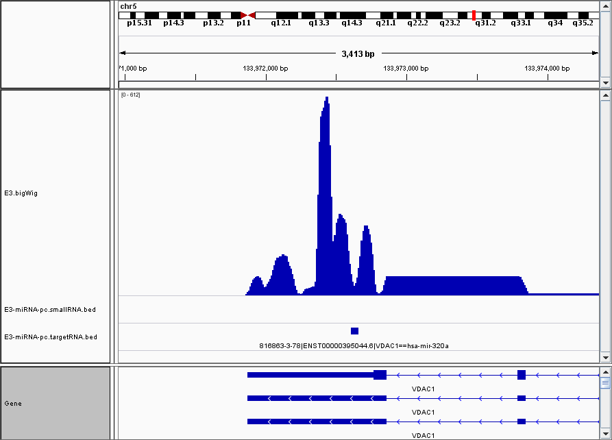

.. CLASHChimeras documentation master file, created by
   sphinx-quickstart on Sun Jun 28 11:30:45 2015.
   You can adapt this file completely to your liking, but it should at least
   contain the root `toctree` directive.

CLASHChimeras
=============

CLASHChimeras is a Python_ package for analysing CLASH_ datasets. It takes
raw fastq files as input and provides comprehensive analysis of RNA
profiles and chimeric reads identification. The output is CSV_ and BED_ format
files for easy visualization in Genome Browsers.

Installation
============

You can install it using pip_ after you have setup Python version 3.4 or above.
Please use this guide_ for setting up Python_ if you have not done it already.
After setting up Python_ and pip_, you can run this on your shell

For local installation (Usually ``$HOME/.local``):

.. code-block:: bash

   $ pip3 install --user CLASHChimeras

For global installation (Usually ``/usr/``):

.. note:: You should have ``sudo`` privileges

.. code-block:: bash

   $ sudo pip3 install CLASHChimeras

Dependencies
============

.. warning:: These dependencies must be satisfied if you want to use
 align-for-chimeras_

CLASHChimeras requires certain software to be installed and setup before you
can use it completely. The software you need to explicitly install are the
following:

* Bowtie2_ - Fast and sensitive read alignment
* Tophat_ - A spliced read mapper for RNA-Seq

.. _pip: https://pypi.python.org/pypi/pip
.. _guide: https://docs.python.org/3.4/using/index.html
.. _Bowtie2: http://bowtie-bio.sourceforge.net/bowtie2/manual.shtml
.. _Tophat: http://ccb.jhu.edu/software/tophat/index.shtml

Usage
=====

The package can be used by three executable scripts:

#. download-for-chimeras_
#. align-for-chimeras_
#. find-chimeras_

download-for-chimeras
---------------------

.. argparse::
   :ref: clashchimeras.download.parseArguments
   :prog: download-for-chimeras

align-for-chimeras
------------------

.. warning:: The input fastq is expected to be adapter trimmed and quality
 controlled

.. note:: Flexbar_ can be used to trim raw fastq sequences

.. argparse::
   :ref: clashchimeras.align.parseArguments
   :prog: align-for-chimeras

find-chimeras
-------------

.. note:: It's recommended that you provide SAM files as input which are
 generated using align-for-chimeras_

.. todo:: Provide support for detecting chimeras between same RNA types

.. argparse::
   :ref: clashchimeras.find.parseArguments
   :prog: find-chimeras

.. _Python: https://www.python.org
.. _CLASH: http://www.nature.com/nprot/journal/v9/n3/abs/nprot.2014.043.html
.. _CSV: https://en.wikipedia.org/wiki/Tab-separated_values
.. _BED: http://www.genome.ucsc.edu/FAQ/FAQformat.html#format1
.. _here: http://www.ncbi.nlm.nih.gov/geo/query/acc.cgi?acc=GSM1219489
.. _Flexbar: http://sourceforge.net/p/flexbar/wiki/Manual/
.. _Gencode: http://www.gencodegenes.org/
.. _miRBase: http://mirbase.org/
.. _IGV: https://www.broadinstitute.org/igv/

Example
=======

We will be using the a dataset from CLASH_ experiment which is hosted here_

In this instance, we'll be using the first 4 million reads from the dataset.
The sequential order to find chimeras on CLASH_ datasets using this package
is the following:

Run ``download-for-chimeras``
-----------------------------

Run download-for-chimeras_ for the first time to download sequences and
generate necessary indexes

The dataset that we are using here belong to *H. sapiens*. The sequence
database needs to be downloaded from Gencode_ and miRBase_. Here's how you
can download:

The code below assumes the default path as ``~/db/CLASHChimeras`` but if you
want a different folder to put your sequences, please specify it using
``--path /path/to/your/folder`` as a argument. It's highly recommended to
get yourself familiar with the arguments by typing ``download-for-chimeras -h``

.. code-block:: bash

   $ download-for-chimeras -gor "H.sapiens" -mor hsa

.. note:: It's an interactive script which prompts for user input when selecting
 the release version.

.. warning:: Please be patient as this is a big download and index generation
 takes even longer

.. warning:: The latest release from Gencode when downloaded and after all
 indexes are generated, takes around 11G of space

Below is an example of how download-for-chimeras_ runs.

.. note:: All the database files are already present in this example run, so
 they are verified by sha256sums. Thus, the timestamps are very close to each
 other. Actual download and generation of indexes will take a while

.. raw:: html

   <iframe src="http://showterm.io/6dc543b9177ddd86a119a#stop" width="640"
   height="480">
   </iframe>

Indexes
-------

There are a series of bowtie2_ and tophat_ indexes generated after you've run
``download-for-chimeras`` script. Assuming that you ran the command below and
selected the latest versions of Gencode_ and miRBase_, the following indexes
will be generated automatically

.. code-block:: bash

   $ download-for-chimeras -gor "H.sapiens" -mor hsa

smallRNA & targetRNA Indexes
****************************

These indexes can be used as ``--smallRNAIndex -si`` or ``--targetRNAIndex
-ti`` in align-for-chimeras_

======================================================================== ========== ==============
Path for index                                                           Index Type RNA Type
======================================================================== ========== ==============
~/db/CLASHChimeras/Gencode/H.sapiens/22/gencode.v22.pc_transcripts       Bowtie2    protein_coding
~/db/CLASHChimeras/Gencode/H.sapiens/22/gencode.v22.lncRNA_transcripts   Bowtie2    lncRNA
~/db/CLASHChimeras/Gencode/H.sapiens/22/gencode.v22.snoRNA_transcripts   Bowtie2    snoRNA
~/db/CLASHChimeras/Gencode/H.sapiens/22/gencode.v22.snRNA_transcripts    Bowtie2    snRNA
~/db/CLASHChimeras/Gencode/H.sapiens/22/gencode.v22.tRNA_transcripts     Bowtie2    tRNA
~/db/CLASHChimeras/Gencode/H.sapiens/22/gencode.v22.misc_RNA_transcripts Bowtie2    misc_RNA
~/db/CLASHChimeras/Mirbase/21/hsa-hairpin                                Bowtie2    miRNA-hairpin
~/db/CLASHChimeras/Mirbase/21/hsa-mature                                 Bowtie2    miRNA-mature
======================================================================== ========== ==============

Genome-Index
************

This index should be provided if you run ``align-for-chimeras`` with
``--run tophat``

========================================================= =============
Path for index                                            Type
========================================================= =============
~/db/CLASHChimeras/Gencode/H.sapiens/22/GRCh38.p2.genome  Bowtie2
========================================================= =============

Transcriptome-Index
*******************

This index should be provided if you run ``align-for-chimeras`` with
``--run tophat`` along with Genome-Index_

===================================================================================  =============
Path for index                                                                       Type
===================================================================================  =============
~/db/CLASHChimeras/Gencode/H.sapiens/22/gencode.v22.chr_patch_hapl_scaff.annotation  tophat
===================================================================================  =============

Annotation
----------

======================================================================================= ==============
Annotation File                                                                         RNA type
======================================================================================= ==============
~/db/CLASHChimeras/Gencode/H.sapiens/22/gencode.v22.chr_patch_hapl_scaff.annotation.gtf protein_coding
~/db/CLASHChimeras/Gencode/H.sapiens/22/gencode.v22.chr_patch_hapl_scaff.annotation.gtf lncRNA
~/db/CLASHChimeras/Gencode/H.sapiens/22/gencode.v22.chr_patch_hapl_scaff.annotation.gtf snRNA
~/db/CLASHChimeras/Gencode/H.sapiens/22/gencode.v22.chr_patch_hapl_scaff.annotation.gtf snoRNA
~/db/CLASHChimeras/Gencode/H.sapiens/22/gencode.v22.chr_patch_hapl_scaff.annotation.gtf misc_RNA
~/db/CLASHChimeras/Gencode/H.sapiens/22/gencode.v22.tRNAs.gtf                           tRNA
~/db/CLASHChimeras/Mirbase/21/hsa.gff3                                                  miRNA
======================================================================================= ==============

Run ``align-for-chimeras``
--------------------------

.. note:: Please refer to Indexes_ when selecting ``--smallRNAIndex -si`` or
 ``targetRNAIndex -ti`` when you run align-for-chimeras_

For this instance, we want to find the chimeras between miRNA and
protein_coding from the raw reads. After you have successfully run
``download-for-chimeras`` and made sure that all the indexes are present for
your alignment to begin, please use the following command

.. code-block:: bash

   $ align-for-chimeras -i E3_4M.fastq.gz -gz -r bowtie2 -si ~/db/CLASHChimeras/Mirbase/21/hsa-hairpin -ti ~/db/CLASHChimeras/Gencode/H.sapiens/22/gencode.v22.pc_transcripts -o E3-miRNA-pc

This is how it runs.

.. raw:: html

   <iframe src="http://showterm.io/60c170c6f20715965b271#stop" width="640"
   height="480">
   </iframe>

After the successful execution of ``align-for-chimeras``, these are the files
that are generated

* E3-miRNA-pc.smallRNA.sam
* E3-miRNA-pc.targetRNA.sam

.. note:: Please use ``--threads -n`` to specify the number of cores to use
 when executing Bowtie2_

``align-for-chimeras`` also provides an argument to run tophat_ as well. This
helps in visualise the transcript coverage across the genome. Please use the
following command to align to the whole genome

.. code-block:: bash

   $ align-for-chimeras -i E3_4M.fastq.gz -gz -r tophat -gi ~/db/CLASHChimeras/Gencode/H.sapiens/22/GRCh38.p2.genome -tri ~/db/CLASHChimeras/Gencode/H.sapiens/22/gencode.v22.chr_patch_hapl_scaff.annotation -o E3_4M

To create bigWig_ file from the tophat_ output, I'd recommend using
deepTools_ to create normalized coverage file from the following wiki page_

.. _deepTools: https://github.com/fidelram/deepTools
.. _page: https://github.com/fidelram/deepTools/wiki/Normalizations
.. _bigWig: https://genome.ucsc.edu/goldenPath/help/bigWig.html

Let's move forward with finding chimeras between these RNA types

Run ``find-chimeras``
---------------------

.. note:: Please refer to Annotation_ when selection ``--smallRNAAnnotation
 -si`` or ``--targetRNAIndex -ti`` when you run find-chimeras_

Following up after running ``align-for-chimeras``, it's time to detect chimeras.
Please make sure that you have the SAM files generated from
``align-for-chimeras``, please use the following command

.. code-block:: bash

   $ find-chimeras -s E3-miRNA-pc.smallRNA.sam -t E3-miRNA-pc.targetRNA.sam -ggs -sa ~/db/CLASHChimeras/Mirbase/21/hsa.gff3 -ggt -ta ~/db/CLASHChimeras/Gencode/H.sapiens/22/gencode.v22.chr_patch_hapl_scaff.annotation.gtf -o E3-miRNA-pc

This is how the above command runs

.. raw:: html

   <iframe src="http://showterm.io/1b6546c29dd68f7b54075#stop" width="700"
   height="480">
   </iframe>

After the successful execution of ``find-chimeras``, these are the files that
are generated

* E3-miRNA-pc.chimeras.tsv
* E3-miRNA-pc.smallRNA.bed
* E3-miRNA-pc.targetRNA.bed

.. note:: Please note if you have not specified
 ``--getGenomicLocationsSmallRNA -ggs``, ``<sample>.smallRNA.bed`` will not be
 generated. If you haven't specified ``--getGenomicLocationsTargetRNA -ggt``,
 ``<sample>.targetRNA.bed`` will not be generated.

You can view the chimeras from the ``<sample>.chimeras.tsv`` file that is
generated. If you want to visualize the data in genome browsers, you can do
that by adding the ``<sample>.smallRNA.bed`` and ``<sample>.targetRNA.bed``
in the IGV_ or your genome browser of choice.

.. note:: Please check the genome assembly version described in Genome-Index_
 and make sure you have the same or corresponding version set in your genome
 browser

Possible combinations
---------------------

Because of the modular design of the software, it is possible to find
chimeras between different types of RNA. Please refer to Indexes_ and run
align-for-chimeras_ with the smallRNA and targetRNA of your choice.

Visualisation in Genome Browser
===============================

This is an example visualization in IGV_ with the normalized coverage
included as a track

Chimeras table
==============

Here is the example chimeras table that is generated. The columns
information can be found **commented** in the first lines

.. raw:: html

   <iframe src="http://showterm.io/45068c14b75cad19c561a#19" width="700",
    height="700"></iframe>

Issues & Feedback
=================

If you encounter any issues, please report it on the Issues_ page of the
Github repository_. Please feel free to offer your suggestions and feedback
and contribute by submitting pull requests.

.. _Issues: https://github.com/kashyapchhatbar/CLASHChimeras/issues
.. _repository: https://github.com/kashyapchhatbar/CLASHChimeras/
